# Claude Deck — Ulanzi D200 plugin

Claude Code on the Ulanzi Deck D200 (macOS): live status pet, answer Claude's questions from deck keys, and a big-screen session display. Fully portable (no hardcoded paths) and marketplace-ready.

<p align="center">
  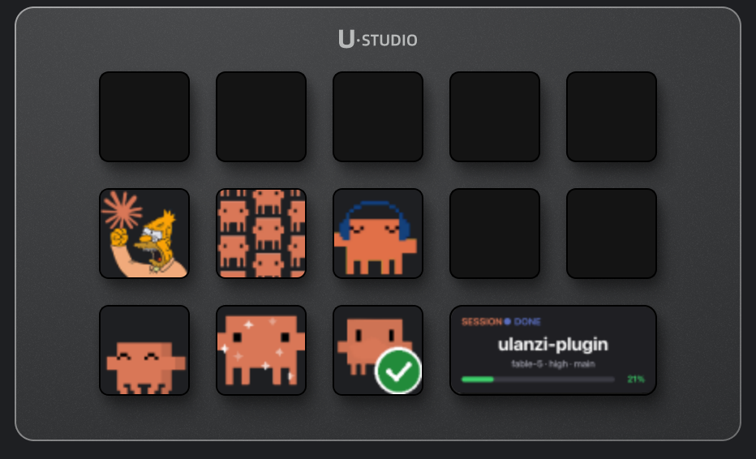
</p>

## How it works

Ulanzi Studio scans `~/Library/Application Support/Ulanzi/UlanziDeck/Plugins/`, launches the plugin's `plugin/app.js` with its bundled Node.js (`127.0.0.1 3906 <lang>`), and talks WebSocket on `localhost:3906`. SDK client in `plugin/plugin-common-node/`.

Claude Code state comes from **hooks**: `hooks/claude-hook.py` runs on every Claude event → one JSON state file per session in `~/Library/Application Support/Ulanzi/UlanziDeck/claude-state/` → plugin polls (pet/opt keys 1 s, big key 3 s). Hooks are wired into every `~/.claude*` profile by `sync-hooks.sh` (runs on install) **or** self-served from the plugin's settings panel ("Enable Claude tracking" button — marketplace installs need no scripts).

## Actions (7)

| Action | What it does |
|---|---|
| **Claude Pet** | Status GIF across all sessions (or one project via dir filter). Press = jump to the session needing you (by TTY). |
| **Claude Option Next** | Cycle the options Claude is asking (shown on big key). Wave GIF when a question is live, dancing when idle. |
| **Claude Option OK** | Answer with the shown option — types the digit into that exact terminal session, no focus steal, auto-submits. Idea GIF live / sparkle idle. |
| **Claude Screen Setup** | One-press toggle of the big screen: Claude status ↔ built-in widget. Studio restarts itself (~15 s). Icons: approved = showing, jam = hidden, loading = applying. Panel hosts the hook-setup button. |
| **Claude Session Switch** | Pins and cycles which tracked session the big key shows (one way, wraps around). With several sessions asking at once, the pin also chooses which question shows/answers first. |
| **Claude Compact** | Compacts the top session's context from the deck. Two-press confirm: yells image idle → press once → eyes image for 8 s → press again → `/compact` typed into that session's terminal. Bonk GIF while the session is compacting. |
| **Claude Session Screen** | The big-key display: top-priority Claude session — project name, status badge, `model · effort · branch` row and a colored context bar (or a compaction progress bar) — plus the question picker when asking and a confirm flash after OK. Shows a "no session" placeholder when nothing is tracked (never the stale terminal name). Placed on the big key by Screen Setup. Panel hosts the terminal selector. |

All small keys show the fail image when no claude session is tracked.

### Key guide — what each GIF means

**Claude Pet** — one glance, all sessions:

| 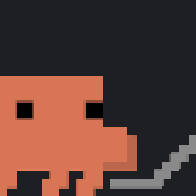 | 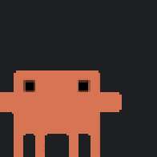 | 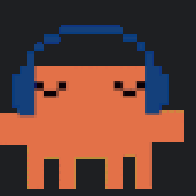 | 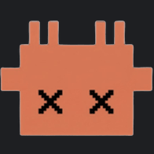 |
|:---:|:---:|:---:|:---:|
| working / compacting | asking or needs you | idle | no session tracked |

**Option Next / Option OK** — the question-answering pair:

| 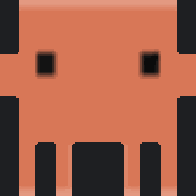 | 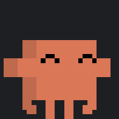 | 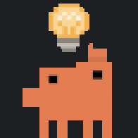 | 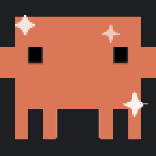 |
|:---:|:---:|:---:|:---:|
| Next: question live | Next: idle | OK: question live | OK: idle |

**Claude Compact** — two-press confirm:

|  | 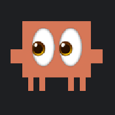 | 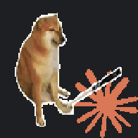 |
|:---:|:---:|:---:|
| ready | press again to confirm | compacting… |

**Claude Screen Setup** — big-screen toggle:

| 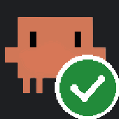 |  | 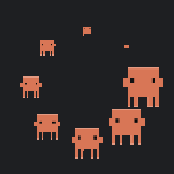 |
|:---:|:---:|:---:|
| big screen showing Claude | big screen hidden | applying (Studio restarting) |

**Claude Session Switch** — session pinning:

| 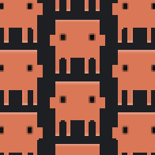 |  |
|:---:|:---:|
| sessions tracked — press to cycle | nothing to switch |

### Question picker (big key + Option keys)

- **Single-select question**: options cycle on the big key, OK types the digit — the TUI auto-submits.
- **Multi-question ask** (tabbed UI with a Submit tab): the big key shows `CLAUDE ASKS 2/3`, each digit answer auto-advances the TUI tab and the deck follows; after the last question a "press OK to submit" screen sends Enter on the Submit tab.
- **multiSelect anywhere in the ask**: not deck-drivable (see gotchas) — the big key shows "answer in the terminal" and OK jumps focus to that session.

The session screen is **claude-driven, not terminal-driven**: the name is the session's project folder from Claude state (the focused terminal tab used to leak names like "node"). The extra info comes from the hook's `session_info()`: model + context tokens + git branch parsed from the tail of the session transcript, effort + context-window size from the profile's `settings.json` (`[1m]` in the model id → 1 M window, else 200 k). Context bar: green < 60 %, yellow < 85 %, red above. The `idx/total` session counter only renders with 2+ tracked sessions (`1/1` is noise).

While a session is **compacting**, the context bar is replaced by a yellow progress bar. Claude Code exposes no real compaction percent (only PreCompact fires, then silence until the session resumes), so the bar is time-driven: `min(95, 100·(1−e^(−elapsed/20)))` — eases fast, parks at 95 %, disappears when the state flips. The big key polls at 1 s during compaction (3 s otherwise) so it animates smoothly.

## State pipeline

Priority: **asking > attention > compacting > working > waiting**. Stale: asking/working/compacting >15 min → waiting; files >12 h ignored; SessionEnd deletes.

| State | Hook events |
|---|---|
| working | UserPromptSubmit, PreToolUse, PostToolUse |
| compacting | PreCompact |
| asking | PreToolUse **or** PermissionRequest of AskUserQuestion/ExitPlanMode (all questions captured from `tool_input` into `ask.questions[]`, first mirrored top-level for older readers) |
| attention | PermissionRequest (other tools); Notification only when message mentions "permission" |
| waiting | Stop, SessionStart |

**Event-ordering bugs fixed in the hook (do not regress):**
1. PermissionRequest fires ~0 s after PreToolUse for AskUserQuestion → must also map to `asking` or options get wiped
2. Notification fires for 60 s-idle → only permission messages may set attention
3. **A Notification fires ~6 s into every pending question (message mentions permission) and auto-compact can fire mid-question → neither may overwrite `asking`** (hook checks existing state first)
4. Canceling a question (Esc) fires NO hook — state clears on next session event or the 15-min stale rule; per-session isolation is intentional

## Terminal support

Adapter layer (`plugin/terminals.js`): all terminal-specific AppleScript isolated. Supported: **iTerm2, Terminal.app** — auto-detected, chosen via dropdown in the Pet / Session Screen panels (global, stored in `claude-state/.terminal-choice`, survives reinstalls). Default: iTerm2 if installed, else Terminal.app. Adding kitty/WezTerm/tmux = one adapter object each. Fully terminal-agnostic operation is impossible on macOS (no generic tty input injection — TIOCSTI is disabled), which is why adapters exist.

## The big key (458×196, slot 3_2)

Studio hard-wires the slot to its built-in widget; the widget mode list is compiled into the signed binary — not extensible, plugins can't be dragged there. Managed instead by **Claude Screen Setup**: press → `hooks/bigkey-toggle.sh` (detached) quits Studio, `hooks/patch-bigkey.py` patches per the `.bigkey-desired` flag, relaunches with retries; all logged to `claude-state/bigkey-watcher.log`. On show, the replaced widget entry is saved (`.bigkey-widget.json`) and restored exactly on hide — restoring a background-empty mode leaves a stale frame that looks like a failed hide. `hooks/bigkey-watcher.sh` re-applies after Studio strips the key on page edits. Manual fallback: `./apply-bigkey.sh`.

## Compatibility

| Requirement | Supported |
|---|---|
| OS | **macOS 10.15+ only** (AppleScript terminal injection — no Windows/Linux) |
| Ulanzi Studio | ≥ 3.0.11 |
| Device | Ulanzi D200 (big-screen features target its 458×196 center display; keys work on other Ulanzi decks) |
| Terminal | iTerm2 or Terminal.app (Claude Code running inside one of them) |
| Claude Code | any recent version with hooks support |
| Python | `python3` on PATH (macOS ships one; hooks use stdlib only) |

## Install (users)

1. Download `com.claudedeck.deck.plugin.ulanziPlugin.zip` from the [latest release](https://github.com/chilleno/claude-deck/releases) (dependencies included).
2. Unzip into Ulanzi Studio's plugin folder so you end up with
   `~/Library/Application Support/Ulanzi/UlanziDeck/Plugins/com.claudedeck.deck.plugin.ulanziPlugin/`.
3. Quit and relaunch Ulanzi Studio (sometimes needs a second `open -a "Ulanzi Studio"`).
4. Drag the **Claude Deck** actions onto keys. Open the **Claude Screen Setup** key's panel and press **"Enable Claude tracking"** — this wires the hooks into every `~/.claude*` profile (backs up each settings.json it touches). Restart running Claude sessions once so hooks load.
5. macOS permissions (one-time prompts): Accessibility for Ulanzi Studio + Automation → your terminal.

Installing from a clone instead: run `./install.sh` (rsyncs the plugin, installs the `ws` dependency, syncs hooks).

## Install / update (dev loop)

```sh
./install.sh   # rsync plugin + npm install + sync-hooks.sh across all profiles
```

Quit + relaunch Studio (sometimes needs a second `open -a "Ulanzi Studio"`).

Restart rules: plugin JS/GIFs → Studio restart · `hooks/*.py`/`*.sh` → nothing (read per run) · hook entries in settings.json → claude session restart.

macOS permissions (one-time): Accessibility for Ulanzi Studio + Automation → chosen terminal.

## Marketplace publishing (ugc.ulanzistudio.com)

Self-serve portal: register → Upload Works → Plugins → zip of the `.ulanziPlugin` folder (≤50 MB, folder at zip root) → review → published. Mac-only accepted. UUID immutable after publishing.

Ready: hooks self-setup in-panel · icons per spec (256 + 512@2x plugin, 288 app, 20×20 white SVG category) · 9 language files · listing asset drafts in `assets/store/` (1:1 cover, 3:2 banners, 366×244 gallery). Verify GIF art ownership before submitting (IP policy). Unofficial fast lane: narlei's Community Store (GitHub release + repo URL).

## Debugging

- Hook event log: `touch claude-state/.debug` → `claude-state/events.log` (delete `.debug` after — and always delete any fake `decktest.json`)
- Test hook: pipe fake event JSON into `hooks/claude-hook.py`, inspect `claude-state/<sid>.json`
- Which profile a running claude uses: `ps eww <pid> | grep -o 'CLAUDE_CONFIG_DIR=[^ ]*'`
- Plugin process: `ps aux | grep com.claudedeck`

## Gotchas (hard-won)

- Plugin UUID exactly 4 dot-segments lowercase; action UUIDs 5+; wrong count = silent load failure
- Manifest icons: PNG (or SVG for category/action list); runtime accepts SVG/PNG/GIF data URLs
- `package.json` needs `"type": "module"`; module-level consts before use (hoisting bug once killed startup silently)
- State dir holds helper dotfiles — `readStates()` skips dotfiles and invalid entries; never put non-session JSON there without a leading dot (a widget backup once poisoned aggregation → everything stuck idle)
- PI `select` needs explicit background+color (Studio WebView renders invisible text otherwise); script order: constants → eventEmitter → timers → utils → ulanziApi → page scripts
- Re-send GIFs only on state change — device loops them
- After a deck answer, `OPT.answeredKey` suppresses re-showing that question while state catches up
- iTerm `write text ""` is a **no-op** — a bare Enter must be sent as `write text return newline NO` (AppleScript `return` = CR; Ink's TUI only recognizes `\r` as Enter)
- The Claude Code TUI (Ink) registers **one keypress per stdin write** — batching escape sequences in a single `write text` loses all but the first key
- multiSelect list rows: options → "Other" free-text → Submit; Enter on a row toggles/selects, submit needs arrow-downs to the Submit row. Driving that from the deck proved unreliable (cursor desync) → deck shows "answer in terminal" for multiSelect asks instead
- GIF/PNG normalization: 196×196, aspect kept, pad `#1e1f22`, NEAREST upscale (pixel art), preserve durations; originals in `assets/pet-sources/`, normalized in `resources/pets/`

## License & credits

Code is MIT licensed (see `LICENSE`).

The pet GIFs/PNGs in `assets/pet-sources/` and `resources/pets/` are community/meme
art collected for personal use; ownership of some pieces is unknown. If you are the
author of any of them and want credit or removal, open an issue and it will be
handled right away.
